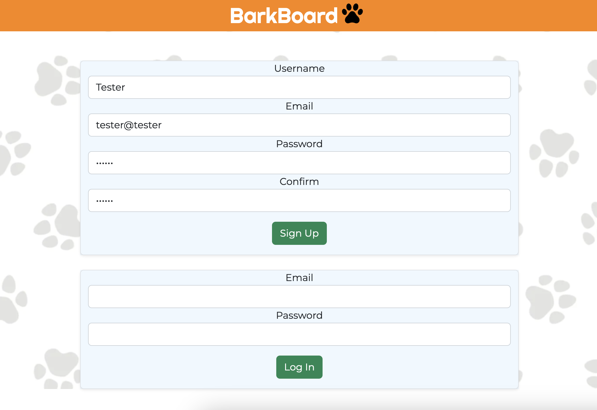
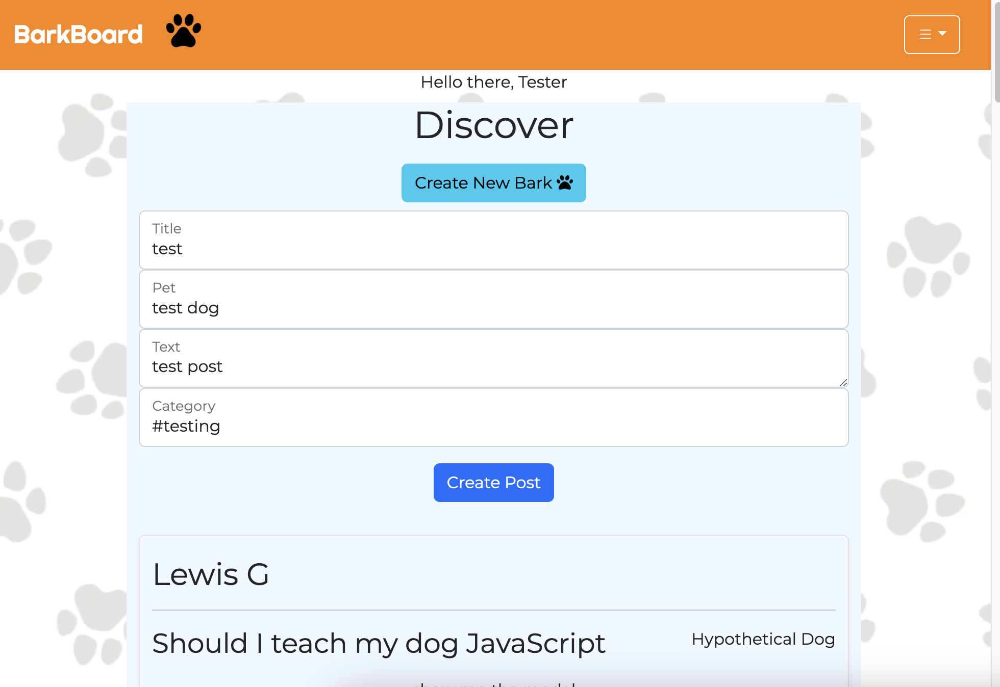
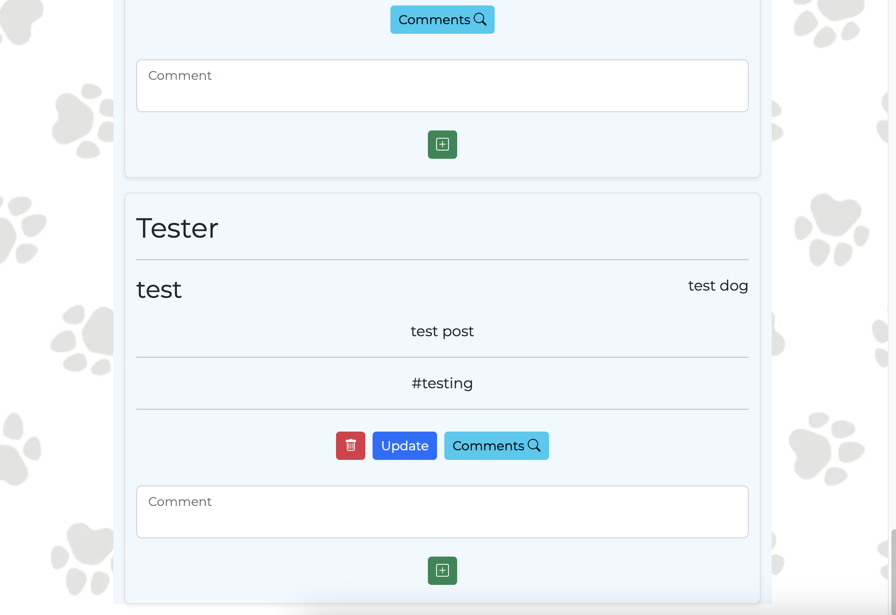
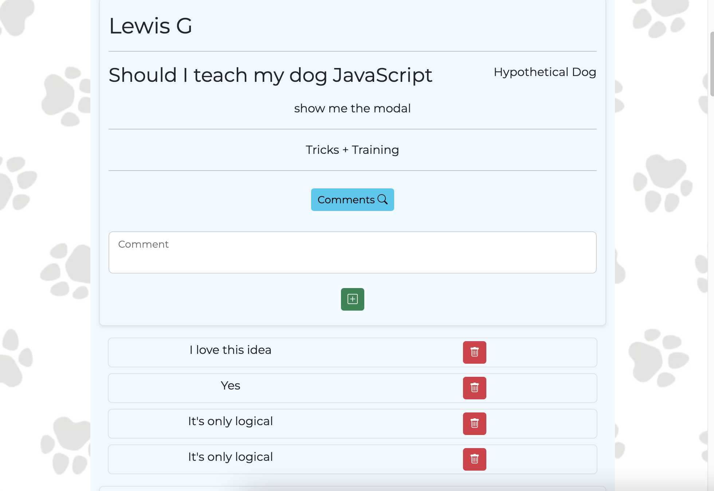
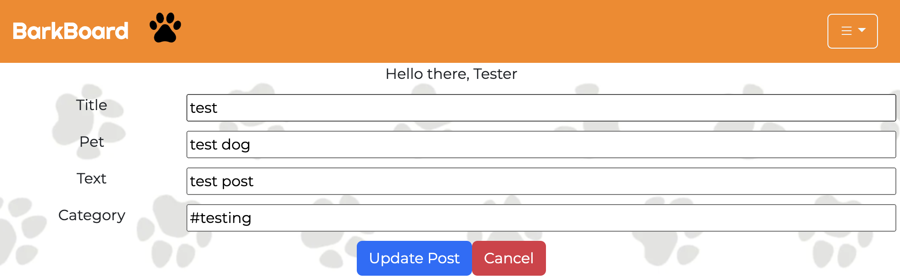
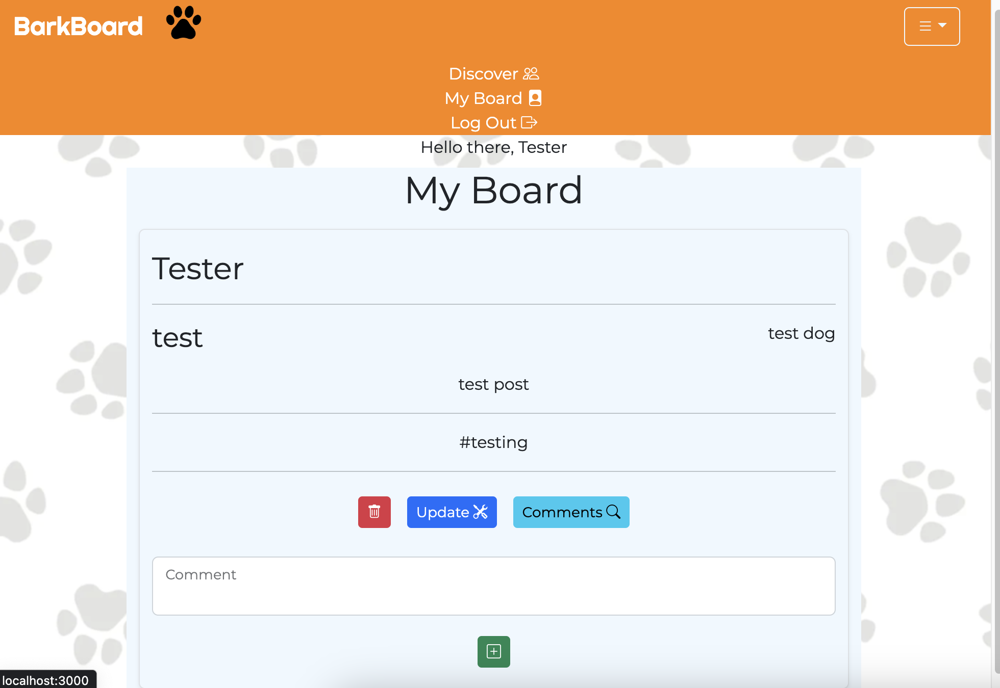

# Bark Board

---

## Bark Board is a social media platform for pets and their owners.

**Bark Board** was created as a message board style social media platform where users can come together to ask questions, share information, and generally speak about their pets and experiences as pet owners. Users first create an account and then can create posts on which a discussion can be held in the comments section. The comment section is styled as a thread tied to the post, so that users can have a contained conversation. Posts can be edited and deleted by the post owner. An extra bit of moderation power is given to users as they may delete any comment made in the thread.

---

## Gallery

---

## Technologies Used

- HTML5
- CSS3
- JavaScript
- Mongoose
- Express
- React
- Node.js
- Bootstrap
- MongoDB

---

## Getting Started

*Live-Link:*    [Bark Board](placeholder)

*Trello Board:* [Trello Board](https://trello.com/b/3dm9w1kE/bark-board-scrum)

*Pitch Deck:*   [Pitch Deck](https://docs.google.com/presentation/d/1vuWaRQB9XFbuDuValHFj2jUcl-Nn37xIAtEep8AkoKA/edit?usp=sharing)

---

## Next Steps

**Version 2.0** will include the following features:

- Admin Accounts
- Ability to link images to posts and comments
- Filter posts by category  
- Ability to follow other users
- Option to see only posts from followed users
- Ability to like posts and comments

**Version 3.0** will include the following features:

- Ability to message other users
- Ability to report posts and comments
- Ability to block users
- Sound effect choices and implementation on button clicks

---

### Our Team

- **Erika Helm**     erikadphelm@gmail.com
- **Heather Knapp**  hknapp15@su.edu
- **Patrick Mangan** pat.mangan@outlook.com
- **Paul Truitt**    truittpaul39@gmail.com
- **Lewis Graves**   Lewisg735@gmail.com